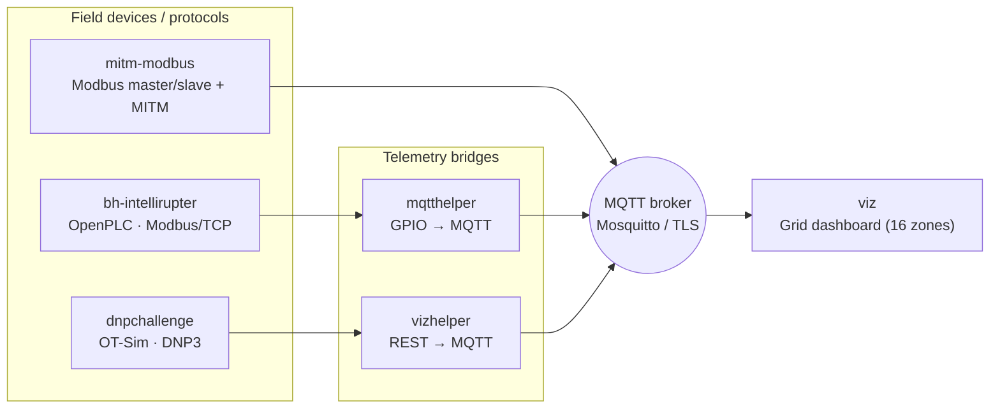

# ICS Village — Wind Challenge

A collection of hands‑on **Industrial Control System (ICS) / Operational Technology (OT)
security challenges** built for the ICS Village. The scenario is a renewable‑energy
theme: a wind farm and its surrounding power grid, visualised as a map of Denver
broken into 16 grid *zones*. Each challenge targets a different industrial protocol
and a different weakness in how OT devices are configured, programmed, and networked.

> ⚠️ **Authorised training use only.** Everything here — vulnerable PLC logic,
> plaintext protocols, and man‑in‑the‑middle tooling — is intentionally insecure and
> exists to teach ICS attack and defence. Do not deploy any of this on a production
> network or against systems you do not own. See [Security notes](#security-notes).

---

## Big picture

The challenges model a small utility with field devices (PLCs / RTUs / IEDs) that
control turbines and protection equipment, an operator HMI, and a central grid
dashboard. Attackers who can reach the OT network manipulate the control traffic to
trip turbines, keep them running unsafely, or drop grid zones — and the effect is
reflected live on the shared visualisation.



The **shared plumbing** is MQTT: every challenge reports zone state to an MQTT broker,
and the [`viz`](#5-viz--grid-dashboard) dashboard renders those zones on the Denver map.

---

## Challenges at a glance

| Folder | Protocol / tech | What it teaches | Key ports |
| --- | --- | --- | --- |
| [`bh-intellirupter`](#1-bh-intellirupter--openplc-turbine-protection) | Modbus/TCP · OpenPLC · IEC 61131‑3 ST | Reading & writing PLC coils/inputs, abusing protection logic to trip or over‑run a turbine | `5000→502` Modbus, `9000→8080` OpenPLC web, `8888/8889` HMI |
| [`dnpchallenge`](#2-dnpchallenge--dnp3-e-stop) | DNP3 · OT-Sim · Telnet | DNP3 master/outstation, control‑relay writes, Telnet field access, an e‑stop workflow | `20000` DNP3, `2323→23` Telnet, `9101/9102` REST |
| [`mitm-modbus`](#3-mitm-modbus--modbus-man-in-the-middle) | Modbus/TCP · ettercap | ARP poisoning + packet filters that silently flip Modbus write values | container `502` Modbus |
| [`mqtthelper`](#4-mqtthelper--gpiomqtt-bridge) | MQTT · Raspberry Pi GPIO | Bridging physical I/O to the dashboard | `1883` MQTT |
| [`viz`](#5-viz--grid-dashboard) | Node.js · Socket.IO · MQTT · Mosquitto | The shared 16‑zone grid dashboard and TLS MQTT broker | `3000` HTTPS, `1883/8443` MQTT |
| `sri-fixed` | OpenPLC | Git submodule — a second checkout of the OpenPLC_v3 runtime (same pinned commit as `bh-intellirupter/OpenPLC_v3`) | — |

Each folder has its own `README.md` with the full details, wiring, and objective.

> **Submodules.** `bh-intellirupter/OpenPLC_v3` and `sri-fixed` are Git submodules that
> pull in the [OpenPLC_v3](https://github.com/thiagoralves/OpenPLC_v3) runtime. Clone
> with `git clone --recurse-submodules …`, or in an existing clone run
> `git submodule update --init` to populate them.

---

## 1. `bh-intellirupter` — OpenPLC turbine protection

An [OpenPLC](https://openplc.org/) soft‑PLC runs a Structured Text protection program
([`fixedfinal.st`](bh-intellirupter/fixedfinal.st)) that watches a turbine and *trips*
it after repeated faults. An RTU ([`rtu/rtu-speaker.py`](bh-intellirupter/rtu/rtu-speaker.py))
polls the PLC over Modbus/TCP, streams a simulated power value to the operator HMI
([`hmi.py`](bh-intellirupter/hmi.py)), and writes fault coils back to the PLC when the
power leaves its safe band.

The attack surface is the Modbus/TCP interface (and the OpenPLC web UI): anyone on the
OT network can read discrete inputs and write coils, letting them force faults/trips or
suppress the protection so the turbine runs out of bounds. Full details in
[`bh-intellirupter/README.md`](bh-intellirupter/README.md).

## 2. `dnpchallenge` — DNP3 e‑stop

Two [OT-Sim](https://ot-sim.patsec.dev/) nodes model a DNP3 link: a **master/RTU**
([`rtuconfig.xml`](dnpchallenge/rtuconfig.xml)) and an **outstation/IED**
([`iedconfig.xml`](dnpchallenge/iedconfig.xml)) that drives the turbine. The RTU exposes
a Telnet console and an emergency‑stop workflow; the outstation exposes DNP3 on port
`20000`. The objective revolves around DNP3 control‑relay writes and the Telnet console
to operate the turbine. Full details in [`dnpchallenge/README.md`](dnpchallenge/README.md).

## 3. `mitm-modbus` — Modbus man‑in‑the‑middle

A Modbus master ([`master/master.py`](mitm-modbus/master/master.py)) periodically writes
a shutdown coil to a slave ([`slave/slave.py`](mitm-modbus/slave/slave.py)) that toggles
GPIO and reports to MQTT. The [ettercap filter](mitm-modbus/etter.filter.modbus)
demonstrates a classic OT attack: sit between master and slave via ARP poisoning and
rewrite the coil value on the wire (`0xFF00` "ON" → `0x0000` "OFF"), so the operator's
command never lands. Full details in [`mitm-modbus/README.md`](mitm-modbus/README.md).

## 4. `mqtthelper` — GPIO/MQTT bridge

A small helper that runs `gpio readall` on a Raspberry Pi and publishes the state of
specific pins to MQTT `zone*` topics, feeding the dashboard. Full details in
[`mqtthelper/README.md`](mqtthelper/README.md).

## 5. `viz` — grid dashboard

A Node.js + Express + Socket.IO app ([`server.js`](viz/server.js)) plus a Mosquitto
broker. It subscribes to `zone1`…`zone16`, forwards updates to the browser over
WebSockets, and paints a 4×4 grid of zones over a Denver map — red = *Normal*,
green = *Down*. This is the shared scoreboard every other challenge reports into. Full
details in [`viz/README.md`](viz/README.md).

---

## Getting started

First, make sure the OpenPLC submodules are checked out (see [Submodules](#challenges-at-a-glance)):

```bash
git submodule update --init   # or clone with --recurse-submodules
```

Each challenge is self‑contained and driven by Docker Compose. From a challenge folder:

```bash
docker compose up --build
```

Recommended order for standing up the environment:

1. **`viz`** — start the dashboard + MQTT broker first so other challenges have somewhere
   to publish. Generate certs with [`viz/createcerts.sh`](viz/createcerts.sh) if needed,
   then browse to `https://localhost:3000`.
2. **A field challenge** — bring up `bh-intellirupter`, `dnpchallenge`, or `mitm-modbus`.
3. **Bridges** — `mqtthelper` / `vizhelper` if you are wiring physical or simulated I/O
   into the dashboard.

Some components (`rtu-speaker.py`, `hmi.py`, the DNP3 GPIO configs) use **static field
IP addresses** and Raspberry Pi GPIO, reflecting the physical hardware used at the live
event. When running purely in containers you will need to adjust those addresses/pins to
match your setup — see each challenge README.

### Prerequisites

- Docker + Docker Compose
- For MITM / DNP3 work: a Linux host, `ettercap`, and (optionally) DNP3 client tooling
- For the physical variants: Raspberry Pi hardware with the `RPi.GPIO` / `gpio` (WiringPi) stack

---

## Repository layout

```
ICS-Village-WindChallenge/
├── bh-intellirupter/   # OpenPLC + Modbus turbine protection challenge
├── dnpchallenge/       # OT-Sim DNP3 master/outstation e-stop challenge
├── mitm-modbus/        # Modbus master/slave + ettercap MITM filters
├── mqtthelper/         # Raspberry Pi GPIO → MQTT bridge
├── viz/                # Node.js grid dashboard + Mosquitto MQTT broker
├── sri-fixed/          # Git submodule → OpenPLC_v3 runtime
└── .gitmodules         # Submodule definitions (OpenPLC_v3)
```

---

## Security notes

These challenges are deliberately vulnerable teaching artifacts. A few things to be
aware of before reusing any of it:

- **Committed private keys.** Several `mqtt-certs/` folders contain private keys and
  self‑signed certificates checked into the repo. They are for local demos only —
  regenerate your own (e.g. via [`viz/createcerts.sh`](viz/createcerts.sh)) and never
  reuse these in any environment you care about.
- **No authentication / plaintext protocols.** Modbus and DNP3 here have no auth, MQTT
  allows anonymous connections, and OpenPLC ships with default credentials. That is the
  point of the exercises — not a template to copy.
- **Offensive tooling.** The ettercap filters perform on‑path tampering. Only use them
  on an isolated lab network against these challenge devices.

---

## Acknowledgements

- [OT-Sim](https://ot-sim.patsec.dev/) by **PatriaSecurity LLC** powers the DNP3
  challenge — software emulation tools like OT-Sim are what make challenges like this
  possible.
- [OpenPLC](https://openplc.org/) provides the soft‑PLC runtime for the Modbus challenge.
- Visualisation and scenario theming initially developed by [NLR](https://www.nlr.gov/) for the [ICS Village](https://icsvillage.com/) at [DEFCON 32](https://defcon.org/html/defcon-32/dc-32-index.html).
