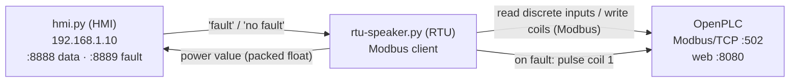

# bh‑intellirupter — OpenPLC turbine protection (Modbus/TCP)

A wind‑turbine **protection / recloser** challenge built on an
[OpenPLC](https://openplc.org/) soft‑PLC. The PLC runs an IEC 61131‑3 Structured Text
program that trips the turbine after repeated faults; an RTU polls the PLC over
Modbus/TCP and streams a simulated power reading to an operator HMI. The Modbus/TCP
interface (and the OpenPLC web UI) is the attack surface.

The name references a self‑healing recloser (an "IntelliRupter"‑style device): the PLC
counts faults and, after three, latches a trip.

## Components

| File | Role |
| --- | --- |
| [`fixedfinal.st`](fixedfinal.st) | The PLC protection program (Structured Text) loaded into OpenPLC |
| [`rtu/rtu-speaker.py`](rtu/rtu-speaker.py) | RTU: Modbus client to the PLC + TCP link to the HMI |
| [`hmi.py`](hmi.py) | Operator HMI: receives power readings, checks the safe band, plots live |
| [`startup.sh`](startup.sh) | Convenience launcher (starts the HMI, then the containers) |
| [`docker-compose.yml`](docker-compose.yml) | Brings up the PLC and RTU containers |
| `OpenPLC_v3/` | OpenPLC runtime build context (Git submodule) |

> **Note:** `OpenPLC_v3/` is a **Git submodule** pointing at the
> [OpenPLC_v3](https://github.com/thiagoralves/OpenPLC_v3) runtime (the `plc` service
> builds from it). If the folder is empty, populate it with
> `git submodule update --init` (from the repo root) — or clone the repo with
> `git clone --recurse-submodules …` — before `docker compose up`.

## Architecture



### Control loop

1. The **RTU** reads discrete inputs from the PLC (address `3`, 8 bits, unit/slave `1`).
2. It derives a **power value**: if the sensor bit is clear it adds Gaussian noise
   (`μ = 0.5`, `σ = 0.09` around a base of `1.0`); if set, it pins the value to `1.5`.
3. The value (a packed big‑endian float, in kW) is sent to the **HMI** on TCP `8888`.
4. The **HMI** checks the safe band **1.2 kW – 1.8 kW**. Outside the band it replies
   `fault`; otherwise `no fault` (on TCP `8889`), and it plots power vs. time with
   Matplotlib (bounds drawn as red dashed lines).
5. On `fault`, the RTU pulses **coil 1** on the PLC (`True` then `False`).
6. The **PLC program** counts fault pulses and latches a **Trip** after three, cutting
   the turbine.

### PLC logic (`fixedfinal.st`)

| Symbol | Address | Meaning |
| --- | --- | --- |
| `VoltageChk` | `%IX0.0` | Voltage OK input |
| `Sensor` | `%IX0.1` | Turbine sensor input |
| `Turbine` | `%QX10` | Turbine run command |
| `Trip` | `%QX0.0` | Trip (turbine off) |
| `Fault` | `%QX0.1` | Fault flag (driven by the RTU's coil pulse) |
| `FaultLight` | `%QX0.4` | Fault indicator lamp |
| `Reset` | `%QX0.6` | Counter reset |
| `Teleruptor` | `%QW15` | Fault count (analog word) |

Behaviour:

- `Turbine := NOT(Trip) AND VoltageChk` — the turbine runs only while not tripped and
  voltage is OK.
- A rising‑edge trigger (`R_TRIG`) on `Fault` feeds an up‑counter `CTU0` with preset
  `PV = 3`; `Trip := CTU0.Q` latches the trip on the **third fault**.
- A `TOF` off‑delay timer (`PT = 15000 ms`) drives `FaultLight` and, when it elapses,
  asserts `Reset` to clear the counter.
- Program task runs every **20 ms**.

## Ports & addressing

`docker-compose.yml` (network `proxiable`):

| Service | Container | Host → container |
| --- | --- | --- |
| `plc` | `plc-container` | `5000 → 502` (Modbus/TCP), `9000 → 8080` (OpenPLC web UI) |
| `rtu` | `rtu-container` | `8888 → 8888`, `8889 → 8889` (HMI sockets) |

The Python scripts use **static field IPs** from the live hardware deployment:

- `rtu-speaker.py` connects to `192.168.2.100` (PLC Modbus `5000`, HMI `8888`/`8889`).
- `hmi.py` binds `192.168.1.10` on `8888`/`8889`.

Adjust these to your environment (e.g. `127.0.0.1` / container IPs) when running locally.

## Running

```bash
# 1. Populate OpenPLC_v3/ with the OpenPLC v3 sources first
docker compose up --build
```

Then either use `startup.sh` as a reference for the launch order (HMI first, then the
field containers) or start the pieces manually. Open the OpenPLC web UI at
`http://localhost:9000` (default OpenPLC credentials) to load `fixedfinal.st` and start
the runtime.

## The objective

Reach the PLC over Modbus/TCP (`:5000`) or the OpenPLC web UI (`:9000`) and manipulate
the protection to your advantage — for example:

- **Trip the turbine** by driving the fault counter (write the fault coil three times /
  spoof the HMI's `fault` response), taking the zone *Down* on the dashboard.
- **Defeat the protection** by holding `Reset`, forcing inputs, or reprogramming the
  logic so the turbine runs outside its safe band.
- **Man‑in‑the‑middle the HMI link** on TCP `8888/8889`, where power values and
  fault/no‑fault verdicts travel as unauthenticated plaintext.

Because Modbus has no authentication and OpenPLC ships with default credentials, any
foothold on the OT network is enough to take control.
