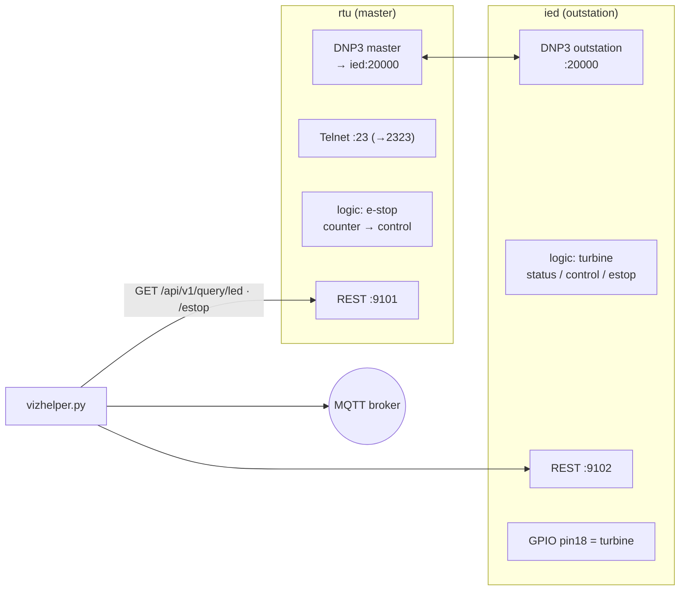

# dnpchallenge — DNP3 turbine e‑stop (OT‑Sim)

A [DNP3](https://en.wikipedia.org/wiki/DNP3) challenge modelling a turbine controlled
over a master ⇄ outstation link, built on [OT-Sim](https://ot-sim.patsec.dev/). One
node is the **master/RTU** (with a Telnet console and an emergency‑stop workflow); the
other is the **outstation/IED** that actually drives the turbine. The goal is to reach
and manipulate the DNP3 control points — "HACK the turbine".

> If you know what this is, you are in the right place — otherwise, leave. 🙂

## Components

| File | Role |
| --- | --- |
| [`rtuconfig.xml`](rtuconfig.xml) | OT‑Sim **master** (DNP3 client) + Telnet + e‑stop logic + GPIO |
| [`iedconfig.xml`](iedconfig.xml) | OT‑Sim **outstation** (DNP3 server) + turbine logic + GPIO |
| [`vizhelper.py`](vizhelper.py) | Polls the OT‑Sim REST APIs and publishes zone state to MQTT |
| [`docker-compose.yml`](docker-compose.yml) | Brings up the `rtu`, `ied`, and `vizhelper` services |
| `mqtt-certs/` | Self‑signed CA/client/server certs used by the MQTT bridge |

## Architecture



### DNP3 points

Both configs share the same two binary points:

| Tag | DNP3 address | Type | Meaning |
| --- | --- | --- | --- |
| `turbine.status` | `0` | binary input | Turbine running state (outstation → master) |
| `turbine.control` | `10` | binary output | Turbine run/stop command (master → outstation) |

- The **outstation** (`iedconfig.xml`) listens on `0.0.0.0:20000` (local address `10`,
  remote `1`) with a **cold‑restart delay of 15 s** and **warm‑restart delay of 5 s**.
  Its logic: `turbine` runs when `control == 1 AND estop == 0`; it publishes
  `turbine.status` and drives GPIO **pin 18**.
- The **master** (`rtuconfig.xml`, local address `1`, remote `10`) reads
  `turbine.status` and writes `turbine.control`. Its e‑stop logic latches when the
  `led` point is set or the `switch` GPIO (pin 16) reads `1`, counts up to ~60 s, and
  forces `control = 0` while active (driving the `led`, GPIO pin 15).

### e‑stop workflow (`rtuconfig.xml` logic)

```text
estopactive = led == true
estopactive = estopactive || switch == 1
counter     = estopactive ? counter + 1 : 0
estopactive = counter > 0 && counter < 60
led         = estopactive
control     = estopactive ? 0 : 1
```

While the e‑stop is active the master commands the turbine off; after ~60 cycles it
releases and allows the turbine to run again.

## Ports

| Service | Purpose | Host → container |
| --- | --- | --- |
| `rtu` | Telnet console | `2323 → 23` |
| `rtu` | OT‑Sim REST API | `9101` (in‑container) |
| `ied` | DNP3 outstation | `20000 → 20000` |
| `ied` | OT‑Sim REST API | `9102` (in‑container) |

Both OT‑Sim containers run `privileged` and map `/dev/gpiomem` for Raspberry Pi GPIO.

## Running

```bash
docker compose up
```

Then interact via:

- **DNP3** — point a DNP3 master at the outstation on `:20000` to read `turbine.status`
  and issue control‑relay output block (CROB) writes to `turbine.control` (address `10`).
- **Telnet** — connect to the RTU console on `:2323` to observe/drive the e‑stop tags.
- **REST** — query OT‑Sim directly, e.g. `GET http://<host>:9102/api/v1/query/estop`.

## The objective

Operate the turbine in a way that is not normally expected. Because DNP3 here carries no
authentication or integrity protection, an attacker on the OT network can:

- **Stop the turbine** by writing `turbine.control = 0` (or triggering the e‑stop),
  taking the grid zone *Down*.
- **Start / hold the turbine on** by writing `turbine.control = 1` and defeating the
  e‑stop, overriding the operator.
- Explore the **restart timing** (cold/warm restart delays) and the Telnet console as
  additional footholds.

## Acknowledgements

With thanks to **PatriaSecurity LLC** for assistance with modifications to
[OT-Sim](https://ot-sim.patsec.dev/ "Operational Technology (OT) Simulator Documentation").
Software emulation tools like OT-Sim are what make challenges like this one possible —
give them a try in your own projects, too!
