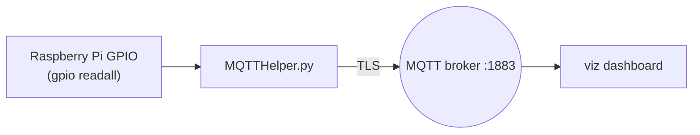

# mqtthelper — GPIO → MQTT bridge

A small helper that runs on a Raspberry Pi, reads the state of specific GPIO pins, and
publishes them to the MQTT `zone*` topics that feed the [`viz`](../viz/README.md)
dashboard. It is support infrastructure for the wind‑farm scenario rather than a
standalone challenge.

## Components

| File | Role |
| --- | --- |
| [`MQTTHelper.py`](MQTTHelper.py) | Reads `gpio readall` and publishes pin states to MQTT |
| [`Dockerfile`](Dockerfile) | Builds the helper image |
| [`requirements.txt`](requirements.txt) | `pymodbus`, `paho-mqtt` |
| [`docker-compose.yml`](docker-compose.yml) | Runs the published `jtsmart/mqtthelper` image |
| `mqtt-certs/` | Self‑signed CA/client/server certs for the TLS MQTT connection |

## How it works



- Connects to the MQTT broker over TLS using the certs in `mqtt-certs/`
  (`tls_insecure_set(True)` — demo certs only).
- Periodically shells out to `gpio readall` (WiringPi), parses the output, and for each
  watched pin publishes `1` (High) or `0` (Low) to the corresponding `zone*` topic.

## Running

```bash
docker compose up
```

> **Notes / caveats**
> - Requires a Raspberry Pi with the WiringPi `gpio` tool available in the container.
> - The [`Dockerfile`](Dockerfile) `CMD` invokes `node MQTTHelper.py`, but this is a
>   Python program — run it with `python3 MQTTHelper.py`.
> - The bundled certificates are for local demos only; regenerate your own before any
>   real use.
