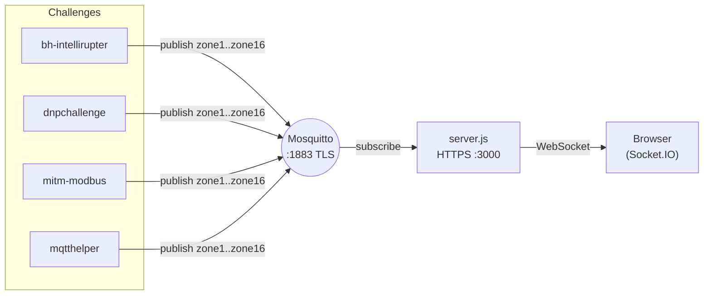

# viz — grid dashboard + MQTT broker

The shared **scoreboard** for the Wind Challenge. A Node.js (Express + Socket.IO) app
subscribes to the MQTT `zone1`…`zone16` topics and paints a 4×4 grid of grid zones over
a map of Denver in real time. Every other challenge reports zone state here.

Zone colours: **red = Normal**, **green = Down**.

## Components

| File | Role |
| --- | --- |
| [`server.js`](server.js) | HTTPS + Socket.IO server; bridges MQTT → browser |
| [`public/index.html`](public/index.html) | Dashboard page (canvas map + 16 zone panels) |
| [`public/main.js`](public/main.js) | Canvas rendering + Socket.IO client |
| [`mosquitto.conf`](mosquitto.conf) | Mosquitto broker config (TLS listener on 1883) |
| [`createcerts.sh`](createcerts.sh) | Generates CA / server / client certificates |
| [`Dockerfile`](Dockerfile) / [`Dockerfilehttps`](Dockerfilehttps) | Image build (HTTP / HTTPS variants) |
| [`index.html`](index.html) / [`index-http.html`](index-http.html) | Standalone/HTTP page variants |
| [`docker-compose.yml`](docker-compose.yml) | Runs the dashboard + Mosquitto broker |
| `mqtt-certs/` | TLS material used by the server and broker |

## Architecture



- [`server.js`](server.js) serves the static dashboard over **HTTPS on port 3000**
  (with Helmet security headers + CSP), connects to the MQTT broker over TLS, subscribes
  to `zone1`…`zone16`, and forwards each message to browsers via Socket.IO
  (`mqttMessage`).
- [`public/main.js`](public/main.js) builds a 4×4 grid of 16 zones over `denMap.png`,
  and updates each zone's colour/label as `zone*` messages arrive (a value of `1`
  renders *Normal*/red, `0` renders *Down*/green).
- [`mosquitto.conf`](mosquitto.conf) configures a TLS listener on `1883`
  (`tls_version tlsv1.2`, `allow_anonymous true`).

## Ports

| Service | Purpose | Ports |
| --- | --- | --- |
| `https` | Dashboard (HTTPS + Socket.IO) | `3000` |
| `mqtt` | Mosquitto broker | `1883`, `8443` |

## Running

```bash
# Generate certificates first if mqtt-certs/ is empty
./createcerts.sh

docker compose up --build
```

Then open `https://localhost:3000` (accept the self‑signed certificate warning).

Publish test data to a zone to see it update, e.g.:

```bash
mosquitto_pub -h localhost -p 1883 --cafile mqtt-certs/ca.pem -t zone5 -m 0
```

## Notes

- Start `viz` **before** the field challenges so they have a broker to publish into.
- The bundled certificates and `allow_anonymous true` are for local demos only —
  regenerate certs and lock down the broker for anything beyond the lab.
